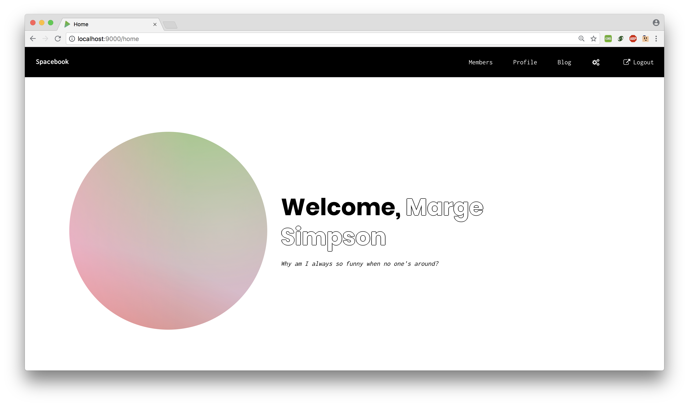
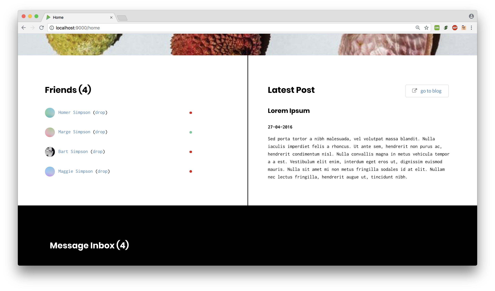
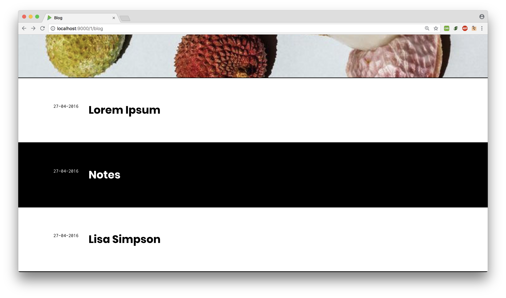

# Spacebook 

Spacebook is a small social networking web application in Java using the Play framework.

* Web development, Assignment 2 
* Base version provided by Eamonn Deleaster.
* Online example deployed on Heroku at [spacebook.herokuapp.com](http://dimitra-spacebook.herokuapp.com). To log in use `<any-simpson>@simpson.com` with password `secret`.

## Usage

Assuming installation of Play (1.4.*)

* `git clone git@github.com:dimitraz/spacebook.git`

* `cd to/repo/`

* `play run` 

## Design

Members page

Home and blog pages

 
